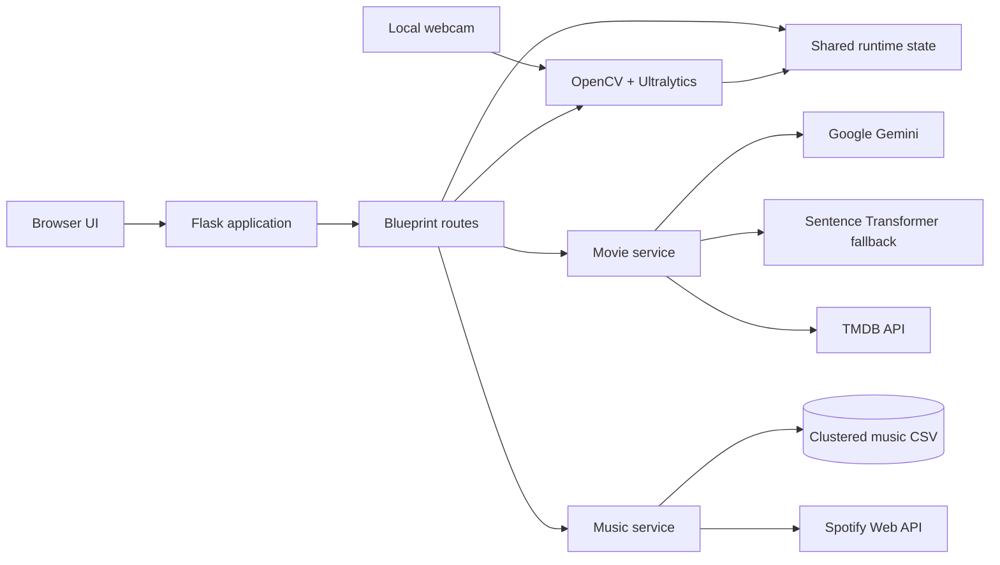

# SAARTHI

> An emotion-aware companion for reflection, recommendations, and supportive conversation.

SAARTHI is a modular Flask application combining facial-expression recognition, mood-aware media discovery, and an empathetic AI chat experience.

## Demo

<video controls width="800">
  <source src="https://github.com/user-attachments/assets/facc7d7a-896e-41c3-8016-532f0a1cb19a" type="video/mp4">
  Your browser does not support video playback.
</video>

## Features

- **Real-time emotion detection** with OpenCV, webcam input, and the bundled Ultralytics model.
- **Mood-aware music discovery** using a local clustered dataset and Spotify.
- **Context-aware movie recommendations** using emoji descriptions, Gemini classification, semantic fallback matching, and TMDB.
- **Supportive AI chat** using Google Gemini with a mature, trauma-informed system prompt.
- **Responsive pages** for mood checking, music, movies, chat, and support resources.
- **Modular Flask design** using an application factory, blueprints, services, templates, and static assets.

## Architecture



The application factory in `app/__init__.py` registers feature blueprints. Route modules handle HTTP requests, service modules contain feature logic, and `app/services/state.py` stores the latest detected emotion for the local process.

## Project structure

```text
SAARTHI/
|-- app/
|   |-- __init__.py                 # Flask application factory
|   |-- config.py                   # Environment-backed configuration
|   |-- models/best.pt              # Emotion detection model
|   |-- routes/                     # Flask blueprints and endpoints
|   |-- services/                   # Detection, movie, music, and state logic
|   |-- static/                     # CSS, JavaScript, assets, and datasets
|   |-- templates/                  # Jinja HTML templates
|   `-- utils/                      # Shared helpers
|-- instance/                       # Optional instance configuration
|-- .env.example                    # Environment template
|-- requirements.txt                # Python dependencies
|-- run.py                          # Development entry point
`-- README.md
```

## Request flows

### Emotion detection

```text
Start feed -> /start_feed -> /video_feed -> webcam + YOLO -> shared emotion state
Browser polling -> /get_emotion -> latest emotion JSON
Stop feed -> /stop_feed
```

### Movie recommendations

```text
Text and emojis -> emoji descriptions -> Gemini classification
                                      -> semantic fallback
                                      -> TMDB -> browser movie cards
```

### Music recommendations

```text
Latest emotion -> mood/cluster mapping -> clustered_music_2.csv
               -> Spotify search -> embedded track link
```

## Requirements

- Python 3.10 or newer
- A webcam for emotion detection
- Spotify Developer credentials
- A TMDB API v3 key
- A Google Gemini API key

## Getting started

### 1. Clone and enter the project

```bash
git clone <repository-url>
cd SAARTHI
```

### 2. Create and activate a virtual environment

PowerShell:

```powershell
python -m venv en
.\en\Scripts\Activate.ps1
```

If PowerShell blocks activation, use the interpreter directly:

```powershell
.\en\Scripts\python.exe -m pip install -r requirements.txt
.\en\Scripts\python.exe run.py
```

macOS/Linux:

```bash
python3 -m venv en
source en/bin/activate
```

### 3. Install dependencies

```bash
python -m pip install -r requirements.txt
```

### 4. Configure environment variables

Copy `.env.example` to `.env` and replace every placeholder:

```env
SPOTIFY_CLIENT_ID=your_spotify_client_id
SPOTIFY_CLIENT_SECRET=your_spotify_client_secret
TMDB_API_KEY=your_tmdb_api_key
GEMINI_API_KEY=your_gemini_api_key
GEMINI_MODEL=gemini-3.5-flash
```

### 5. Run

```bash
python run.py
```

Open <http://127.0.0.1:5000>.

## Configuration

| Variable | Used by | Description |
| --- | --- | --- |
| `SPOTIFY_CLIENT_ID` | Music | Spotify application ID |
| `SPOTIFY_CLIENT_SECRET` | Music | Spotify application secret |
| `TMDB_API_KEY` | Movies | TMDB API v3 key |
| `GEMINI_API_KEY` | Chat and movie classification | Google Gemini API key |
| `GEMINI_MODEL` | Chat and classification | Gemini model; defaults to `gemini-3.5-flash` |

## Application routes

| Route | Method | Purpose |
| --- | --- | --- |
| `/` | GET | Main landing page |
| `/welcome` | GET/POST | Mood-check introduction |
| `/start_feed` | GET | Start emotion processing |
| `/video_feed` | GET | Stream webcam frames |
| `/get_emotion` | GET | Return latest emotion as JSON |
| `/stop_feed` | GET | Stop emotion processing |
| `/get_music` | GET | Render a Spotify recommendation |
| `/movies` | GET/POST | Render the movie page |
| `/get_movie` | POST | Return TMDB recommendations as JSON |
| `/talk` | GET/POST | Render the chat page |
| `/BuddyBot` | GET/POST | Return a Gemini response as JSON |

## Development notes

- Runtime state is process-local and suitable for a single-user local run, not multi-worker production deployment.
- The webcam is accessed by the Python process running Flask.
- The first model load may take time.
- Movie requests retry temporary network and TMDB `5xx` errors with capped exponential backoff.
- Spotify Development Mode may require the app owner to have an active Premium subscription.

## Troubleshooting

**`ModuleNotFoundError`**

```powershell
.\en\Scripts\python.exe -m pip install -r requirements.txt
```

**TMDB key errors:** use a TMDB API v3 key, remove accidental spaces, and restart Flask after editing `.env`.

**Spotify HTTP 403:** check the Spotify Developer Dashboard and the Premium status of the account that owns the app. This restriction cannot be bypassed in code.

**Video has no sound:** browsers block audible autoplay. Use the video controls or interact with the page once to enable audio.

**Webcam feed stops:** check camera permissions, confirm `app/models/best.pt` exists, and close other applications using the webcam.

## Security and privacy

- Keep `.env` out of version control.
- Never log API keys or access tokens.
- Webcam frames are processed by the local Flask process; review this behavior before deployment.
- Emotion predictions are not medical diagnoses, and SAARTHI is not a replacement for professional care or emergency services.
